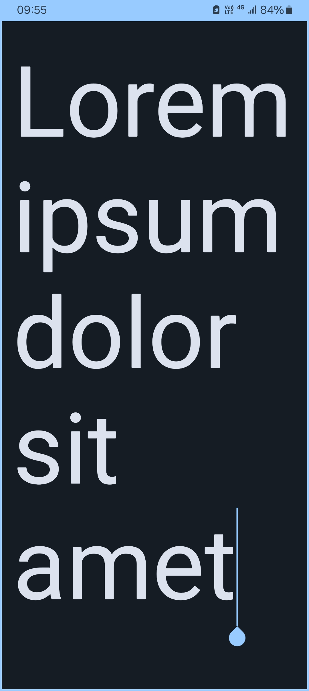

# Scalable Text

Scalable Text is an app that provides nothing but a field where text can be entered.

After inputting some text, or before that, you may use gestures to adjust the font size of the text (as if zooming in/out).

Whatever you input will not be stored, and will disappear once you change some of the settings (for the device) or close the app.

This is useful when you need to show some text to others, when you're not allowed to talk, and when others can't hear you.

### Screenshots

### Note

Do not write important things in this app, or they'll be lost.
